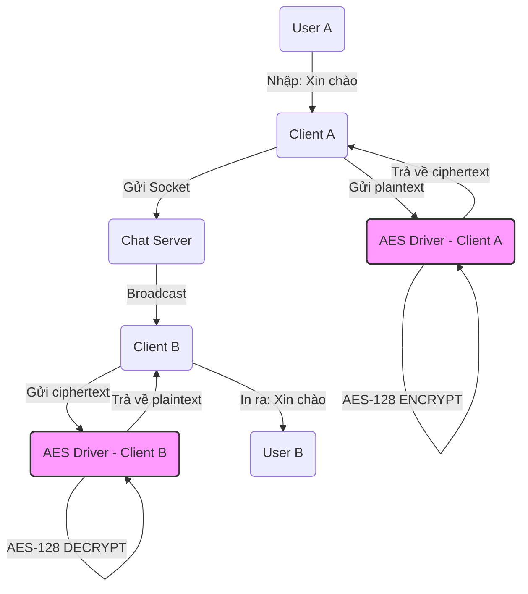

# Chat Socket Ứng Dụng Mã Hóa AES Kernel Driver

Đây là dự án Chat Socket Client-Server trên Linux có hỗ trợ mã hóa đầu cuối (End-to-End Encryption) sử dụng thuật toán AES thông qua một Linux Kernel Module.

## Yêu cầu Hệ thống
- Hệ điều hành Linux (Ubuntu, Debian, v.v.)
- `gcc` compiler
- `make` và Linux Kernel Headers (để biên dịch kernel module)

---

## 1. Biên dịch và Cài đặt Driver Mã hoá AES
Kernel Module `aes_driver.ko` cung cấp thao tác mã hóa. Vì driver được đăng ký với Major Number động, bạn cần tạo file Character Device `/dev/aes_driver` thủ công sau khi load module vào nhân:

```bash
cd driver
make
sudo insmod aes_driver.ko

# Lấy Major Number của driver được cấp phát:
cat /proc/devices | grep aes_driver

# Dùng Major Number vừa tìm được (ví dụ: 240) để tạo file device:
sudo mknod /dev/aes_driver c <Major_Number> 0

# Cấp quyền đọc/ghi cho tất cả người dùng để Client có thể tương tác:
sudo chmod 666 /dev/aes_driver
```
*(Để gỡ driver khi không dùng nữa: `sudo rmmod aes_driver` và `sudo rm /dev/aes_driver`)*

---

## 2. Biên dịch và Chạy Server
Server quản lý việc đăng ký, đăng nhập và định tuyến tin nhắn giữa các phòng chat. Server **không** giải mã tin nhắn.

Mở một Terminal mới:
```bash
cd server
gcc server.c -o server -lpthread
./server
```

---

## 3. Biên dịch và Chạy Client
Client hỗ trợ menu tương tác từng bước dễ dùng: cho phép Đăng ký, Đăng nhập, Tạo và Vào phòng chat tĩnh và xem lại lịch sử. Tin nhắn bạn gửi sẽ được mã hoá tự động bằng Driver trước khi gửi đi.

Mở một hoặc nhiều Terminal mới (tương ứng với nhiều người dùng):
```bash
cd client
gcc client.c -o client -lpthread
./client
```

---

## 4. Các Thư Viện Nổi Bật Được Dùng
Dự án sử dụng ngôn ngữ C cùng các thư viện hệ thống mạnh mẽ trên môi trường Linux:
- **`pthread.h`**: Quản lý đa luồng (multi-threading).
  - *Tại Server*: Khởi tạo các thread riêng lẻ phục vụ cùng lúc nhiều truy cập từ nhiều Client, có cơ chế `mutex_lock` bảo vệ dữ liệu dùng chung (Account, Room).
  - *Tại Client*: Chạy ngầm một luồng song song (`receiver`) để liên tục lắng nghe tin nhắn từ Server mà không cản trở việc gõ phím của người dùng.
- **`termios.h`**: Tiện ích thay đổi tuỳ chọn luồng giao tiếp của Terminal. Dùng ở tính năng làm ẩn mật khẩu lúc người dùng gõ phím.
- **`sys/socket.h`, `arpa/inet.h`**: Nền tảng cốt lõi cho giao tiếp TCP/IP, tạo đường ống socket duy trì kết nối ổn định giữa Client và Server.
- **Linux Kernel Headers (`linux/module.h`, `linux/fs.h`, ...)**: Cung cấp API lập trình ở cấp độ Kernel Space, hỗ trợ phát triển trình điều khiển ảo.

---

## 5. Kiến Trúc Hệ Thống
Dự án xây dựng dựa trên kiến trúc tập trung **Client-Server** kết hợp cơ chế mã hoá đầu cuối (End-to-end Encryption) và phân tách đặc quyền:
1. **Application Space (Không gian Ứng dụng)**
   - **Server:** Đóng vai trò làm trạm định tuyến. Nhận các kết nối, xác thực tài khoản qua file lưu trữ tĩnh, quản lý danh sách phòng chat và phân phối chính xác các gói tin mã hoá giữa các Client.
   - **Client:** Xử lý giao diện luồng chat trên terminal, làm nhiệm vụ nhận input và điều hướng lệnh đi.
2. **Kernel Space (Không gian Nhân Linux)**
   - **AES-128 Driver:** Việc mã hóa và giải mã không diễn ra ở Client để tránh bị can thiệp ngược bộ nhớ (memory dumping). Thay vào đó, nó nhờ Kernel làm thông qua file hệ thống `/dev/aes_driver`.
3. **Mô hình Bảo mật**
   - Sự an toàn của tin nhắn được bảo đảm bởi tính chất bảo mật đầu cuối (E2EE): Server chỉ biết ai đang gửi cho ai chứ không thể dịch được nội dung.  



---

## 6. Luồng Xử Lý Hệ Thống
1. **Giao tiếp Hệ điều hành (Mã hóa):** 
   - Khi Client có tin nhắn, chuỗi văn bản (plaintext) được chuyển xuống Device Driver (`crypt_msg` dùng `open`, `ioctl` chỉ định mode ENCRYPT, `write`).
   - Driver cắt tin nhắn làm nhiều byte-block (x 16 byte), mã hóa AES-128 thủ công bằng một Static Key cục bộ.
   - Client lấy dữ liệu đã hóa mù (ciphertext) về qua lệnh `read`, đóng gói vào tệp cấu trúc chuẩn mang tên `Packet`.
2. **Truyền dẫn dữ liệu:** 
   - Packet mã hóa được gửi cho Server qua kết nối Socket TCP liên tục.
3. **Chuyển tiếp qua Server:** 
   - Server nhận lệnh, kiểm tra tệp `is_logged_in` và dò tìm theo ID phòng.
   - Server thực hiện thao tác **Broadcast** gói tin (sao chép và pass nguyên trạng khối mã hóa nhị phân) gởi qua socket lại cho các Client đối tác đang có mặt trong phòng đó đó. Đồng thời nhét vào file History của nhóm đễ lưu trữ.
   - *(Ngoài ra Server còn có log riêng báo cáo từng đoạn byte hex tĩnh cho dev)*
4. **Giải mã ở thiết bị đích:** 
   - Thiết bị nhận kích hoạt Thread tự động nhận, tách gói tin.
   - Ném nội dung bị mã hoá ngược xuống `/dev/aes_driver` của máy mình (Mode DECRYPT) để phục hồi. 
   - Cuối cùng in ra cửa sổ giao diện cho người dùng đọc.
